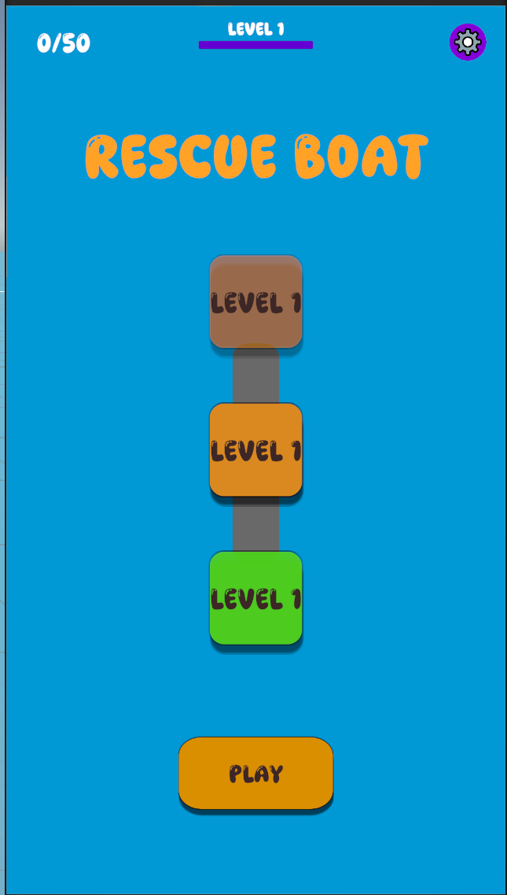
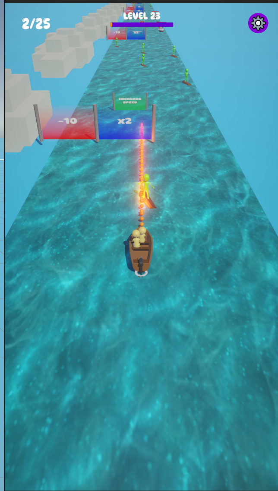
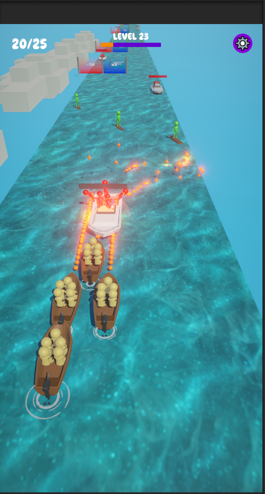
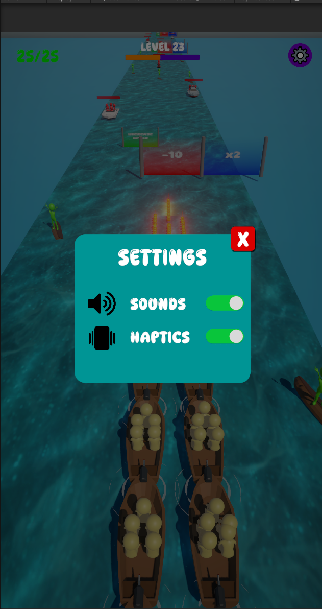
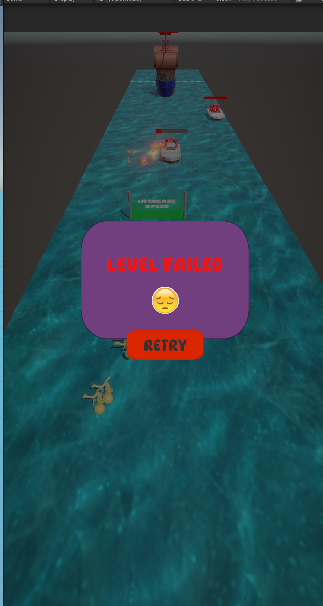

# SaverBoat — Boat Rescue + Shooter Prototype (Unity)

> A from‑scratch mobile prototype: steer a small boat, **rescue passengers**, and **fight enemy boats**. Features a pooled projectile system, simple enemy AI with **search radius + chase**, and togglable **sound & haptics**. Built to practice Unity/C# gameplay loops, input, and lightweight feel tuning.

## Screenshots






---

## Overview

* **Engine:** Unity
* **Language:** C# (gameplay)
* **Packages:** DOTween (UI/feedback)
* **Target:** Mobile (touch/drag) + Editor testing
* **Why:** Practice mobile‑first controls, object interactions, simple AI/combat, settings, and pooling.

> Check the exact Unity version in `ProjectSettings/ProjectVersion.txt`.

---

## Core Gameplay

* **Steer & Rescue:** Drag to steer the boat, pick up survivors, and deliver them to the **drop‑off zone**.
* **Shoot Enemies:** Fire **pooled projectiles** to reduce enemy boat **health** and destroy them.
* **Chase Threat:** If you **don’t** eliminate an enemy and it gets close, a **search radius** triggers; the bot **rotates** to follow/chase you. On contact, **rescued people fall into the sea** (with animations).
* **Finish:** Reach the finish/drop‑off while keeping as many survivors as possible.

**Controls**

* **Mobile:** Drag left/right to steer.
* **Editor/PC:** Drag with the mouse (touch simulated).
* **Shooting:** Bound to the current prototype’s input (button/auto‑fire); see input bindings in the scene/UI.

---

## Features

* **Object Pooling** for all **projectiles** (player & enemy), impact VFX, etc.
* **Projectile System** with lifetime management and pooled reuse.
* **Enemy Boats** with basic **AI**: search radius, **rotation‑to‑target**, simple chase, and shooting.
* **Health/Damage** for enemies (and optionally player/boat if enabled).
* **Rescue/Drop‑off Loop:** Survivors board, can be lost on enemy contact (with **animations**).
* **DOTween** usage for clean UI transitions and quick feedback polish.
* **Settings** panel with **Sound** and **Haptics** **On/Off** toggles (persisted).
* **Audio + Haptics** feedback during shooting, hits, pickups, finish, etc.
* **Simple Camera Follow** tuned for mobile.

---

## Technical Highlights

* **Pooling:** Centralized pools pre‑warm and reuse bullets/VFX to avoid GC spikes and instantiation overhead. Sizes are adjustable in the Inspector.
* **Projectiles:** Collider/Rigidbody setup, time‑to‑live, impact handling, and return‑to‑pool logic.
* **Enemy AI:** Sphere‑based **search radius** → acquire target → **rotate towards player** → chase/shoot. Parameters exposed for tuning (radius, rotation speed, fire rate, damage, etc.).
* **Damage System:** Simple health component; enemies are destroyed when health ≤ 0 (hook for VFX/SFX).
* **Rescue System:** Survivors attach to the boat; on enemy contact they **drop with animation**.
* **Settings & Persistence:** Sound/Haptics toggles saved via `PlayerPrefs` (or equivalent) and respected at runtime.
* **DOTween:** Used for UI anims (panels, buttons, counters) and micro‑interactions.

---

## Project Structure (high‑level)

> Script names may differ; responsibilities below match the prototype’s systems.

* `BoatController` — forward motion & steer from touch/mouse input
* `Input/SwerveInput` — delta capture and lateral movement
* `Projectile`, `ProjectilePool` — bullet behaviour + pooling
* `EnemyBotController` — search radius, rotation‑to‑target, chase, shooting
* `Health`, `Damageable` — HP and damage application
* `Survivor`, `RescueCollector` — pickup/follow & drop‑on‑hit logic
* `GameManager` — states (Playing / Finished / Failed), restart/next
* `SettingsManager` — sound/haptics toggles + persistence
* `AudioManager`, `HapticsManager` — runtime control and feedback
* `CameraFollow` — smooth follow with offset

> **Scene(s):** e.g., `Assets/Scenes/SampleScene.unity` 

---

## Getting Started

1. **Clone**

   ```bash
   git clone https://github.com/cakmakbm/SaverBoat.git
   cd SaverBoat
   ```
2. **Open in Unity Hub** (use the version from `ProjectVersion.txt`).
3. **Import DOTween** (Asset Store / UPM). Then: `Tools → Demigiant → DOTween Utility Panel → Setup DOTween`.
4. Open the main **Scene** and press **Play**.

---


## Screenshots 


---


## Disclaimer

This is an **educational prototype**. Code/art is original unless noted. Not affiliated with any publisher or brand.

---

## Credits

Built by **@cakmakbm**.
Thanks to **Demigiant** for DOTween.
Contributions and feedback are welcome!
